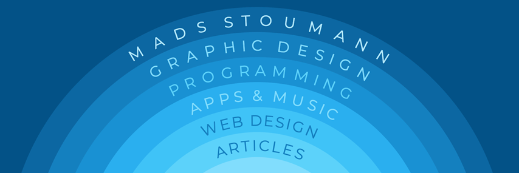

# Hi, I'm Mads. 👋

Thanks for stopping by!

I'm a web developer, graphic designer, type designer, musician, comicbook-geek, LEGO-collector, food lover  … as well as husband and father, located just south of Copenhagen, Denmark.

—— ✻ ——

I'm a co-founder, and work as a Frontend Developer at Perfection.dev

---

## Latest Articles
- [Frontend Security: Security Headers](https://dev.to/madsstoumann/frontend-security-content-security-policy-17dl)
- [Accessible Image Compare — One Line of JavaScript](https://dev.to/madsstoumann/accessible-image-compare-one-line-of-javascript-3gn4)
- [How to Play and Pause CSS Animations with CSS Custom Properties](https://css-tricks.com/how-to-play-and-pause-css-animations-with-css-custom-properties/)

---

## GitHub Stats

<!--

## Skills

**madsstoumann/madsstoumann** is a ✨ _special_ ✨ repository because its `README.md` (this file) appears on your GitHub profile.

Here are some ideas to get you started:

- 🔭 I’m currently working on ...
- 🌱 I’m currently learning ...
- 👯 I’m looking to collaborate on ...
- 🤔 I’m looking for help with ...
- 💬 Ask me about ...
- 📫 How to reach me: ...
- 😄 Pronouns: ...
- ⚡ Fun fact: ...
-->
